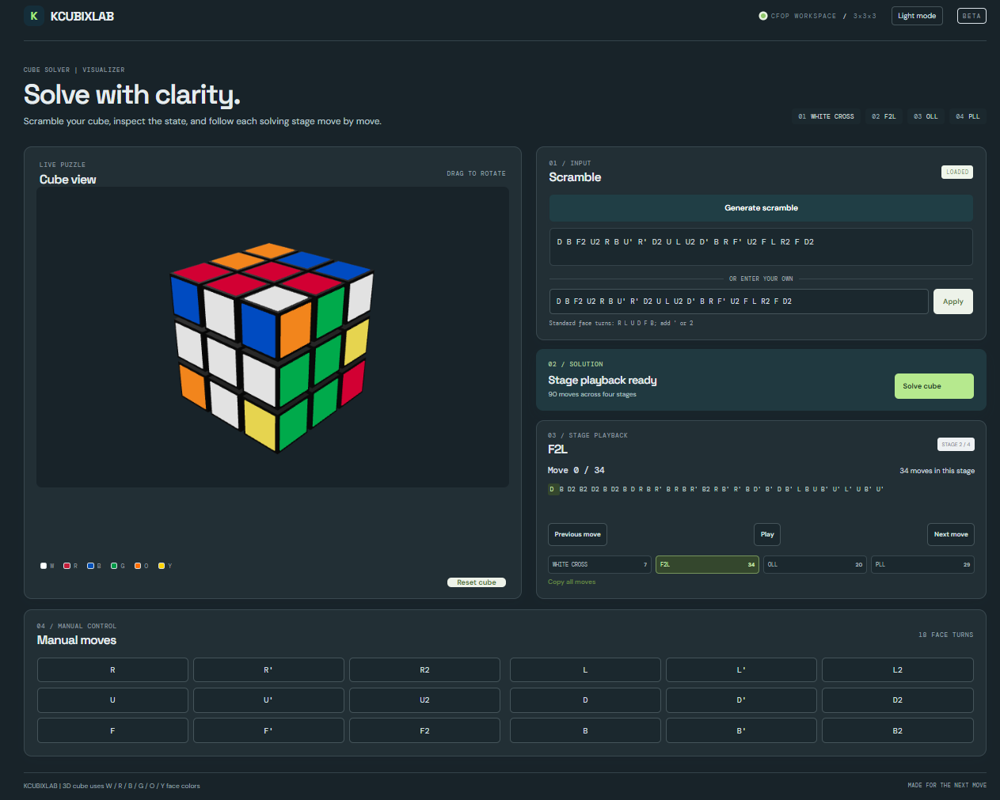

# KCubixLab

KCubixLab is a 3D Rubik's Cube solver built around a C++ solving pipeline and a React-based visualizer. It uses an A* search for the White Cross and a legacy CFOP implementation for F2L, OLL, and PLL, then presents the solution one stage at a time.

## Project overview

The project represents a standard 3×3 cube in code, generates or accepts move scrambles, and solves cube states through a local C++ HTTP API. The browser frontend renders the cube in 3D, supports manual face turns, and animates the returned solution by stage.

## Project image



*KCubixLab cube visualizer and solver interface.*

## Features

- Random 22-move scrambles and custom scrambles using standard face-turn notation
- A* search for the White Cross, followed by legacy F2L, OLL, and PLL stages
- Verification after every solving stage
- Adjacent same-face move simplification for F2L, OLL, and PLL output
- Interactive 3D cube with orbit controls and animated turns
- Stage-by-stage playback with play, pause, previous-move, and next-move controls
- Manual clockwise, inverse, and half turns for all six faces
- Light and dark themes, with the selected theme stored in browser local storage
- C++ pipeline tests and JavaScript cube-state tests

## Solving approach

The solver uses a hybrid architecture: the Cross stage is implemented with A* in this project, while F2L, OLL, and PLL are adapted from the included legacy solver implementation. This is not a Kociemba or two-phase solver, and the complete solution is not claimed to be globally optimal.

```text
Scrambled cube
      │
      ▼
White Cross ── A* search
      │
      ▼
F2L ────────── legacy implementation
      │
      ▼
OLL ────────── legacy implementation
      │
      ▼
PLL ────────── legacy implementation
      │
      ▼
Solved cube
```

### How CFOP works

#### Cross

The Cross stage places the four white edge pieces around the white center and aligns each edge's other color with its matching side center. The implementation searches cube states with A*, prioritizing nodes by `f(n) = g(n) + h(n)`: `g(n)` is the number of moves so far, and `h(n)` counts the unsolved cross edges. The implementation does not claim that this heuristic makes the overall solution optimal.

#### F2L — First Two Layers

F2L pairs each first-layer corner with its corresponding middle-layer edge and inserts the pair into its slot. This repeats for all four slots. KCubixLab calls the legacy F2L implementation included in the source; it does not generate a new F2L algorithm set at runtime.

#### OLL — Orientation of the Last Layer

After F2L, the first two layers are solved and the top-layer pieces may still need orientation and permutation. OLL changes their orientation so the yellow top face is oriented. This stage uses the included legacy OLL implementation.

#### PLL — Permutation of the Last Layer

Once the last-layer pieces are oriented, PLL permutes the top-layer corners and edges into their solved positions. The included legacy PLL implementation handles this final stage.

## Solution pipeline

For an API request, the backend:

1. Parses and validates the supplied cube state.
2. Solves the White Cross with A* and applies those moves.
3. Solves F2L, OLL, and PLL in order using the legacy implementation.
4. Verifies the cube after each stage and checks the final solved state.
5. Returns separate move arrays for the four stages; the frontend validates and displays them.

F2L, OLL, and PLL move sequences are simplified by combining adjacent turns of the same face. The simplifier preserves move order and does not change the solving algorithms. For example:

| Input | Output |
| --- | --- |
| `R R` | `R2` |
| `R R'` | removed |
| `R' R'` | `R2` |
| `R2 R` | `R'` |

## Frontend

The React interface renders 26 cubies with React Three Fiber and Drei orbit controls. Users can generate or enter a scramble, apply individual face turns, request a solution, and play the resulting move sequences stage by stage. Playback supports pausing, resuming, stepping backward or forward, and animating each turn in sequence. A theme toggle switches between light and dark appearance.

## Backend and API

The backend is written in C++17 and built with CMake. It contains cube-state and move handling, scramble generation, the A* Cross solver, stage wrappers for the legacy F2L/OLL/PLL implementation, move simplification, and correctness checks.

The backend exposes a lightweight HTTP API implemented directly with platform sockets; it does not use a web framework. The server binds to `127.0.0.1` and defaults to port `8080`.

### `POST /api/solve`

Request body:

```json
{
  "cube": [
    [[0, 0, 0], [0, 0, 0], [0, 0, 0]],
    [[1, 1, 1], [1, 1, 1], [1, 1, 1]],
    [[2, 2, 2], [2, 2, 2], [2, 2, 2]],
    [[3, 3, 3], [3, 3, 3], [3, 3, 3]],
    [[4, 4, 4], [4, 4, 4], [4, 4, 4]],
    [[5, 5, 5], [5, 5, 5], [5, 5, 5]]
  ]
}
```

The actual `cube` value contains six faces, each with three rows of three integer color IDs. Face order and center IDs are `WHITE=0`, `RED=1`, `BLUE=2`, `GREEN=3`, `ORANGE=4`, and `YELLOW=5`. The server checks the shape, color counts, and fixed center orientation before solving.

A successful response contains `cross`, `f2l`, `oll`, and `pll` arrays of move strings, plus a `counts` object. Invalid requests return a JSON `error` message with status `400`; solver failures return an error with status `422`. The API also handles `OPTIONS` requests for browser preflight.

The Vite development server proxies `/api` to `http://127.0.0.1:8080`. Set `VITE_API_URL` when the frontend needs a different API base URL.

## Technologies used

### Backend

- C++17 and the C++ standard library
- CMake
- Platform sockets: Winsock on Windows and POSIX sockets on other supported builds

### Frontend

- JavaScript ES modules and React 19
- Vite 8 for development and production builds
- Three.js rendering through React Three Fiber, with Drei for scene controls
- CSS for layout, responsive styling, and themes

### Development and validation

- Node.js and npm for frontend scripts and dependencies
- CTest with the `solver_pipeline_tests` C++ executable
- Node's built-in test runner for cube-state tests
- ESLint for frontend linting

## Requirements

- CMake 3.16 or newer
- A C++17-capable compiler
- Node.js and npm; the project does not declare a minimum Node.js or npm version
- A supported platform with the socket APIs used by the backend (Winsock on Windows or POSIX sockets elsewhere)
- No third-party C++ libraries are required

## Project structure

```text
KCubixLab/
├── backend/
│   ├── include/                 # Cube, solver, move, and API declarations
│   ├── src/                     # C++ implementation and server entry point
│   ├── tests/                   # C++ solver pipeline tests
│   └── tools/                   # Legacy algorithm data generation helper
├── frontend/
│   ├── public/                  # Browser icons
│   ├── src/
│   │   ├── Components/
│   │   │   ├── Cube/            # 3D cube and cube-state logic
│   │   │   └── UI_/             # Move input component
│   │   ├── assets/
│   │   ├── App.jsx
│   │   └── ...                  # App styles and entry point
│   ├── package.json
│   ├── package-lock.json
│   └── vite.config.js
├── image.png                    # Project preview
├── CMakeLists.txt
└── README.md
```

## Build and run

### Backend

From the repository root, configure and build the C++ targets:

```sh
cmake -S . -B build
cmake --build build --config Release
```

The executable runs a demo scramble and prints the solution stages when started without arguments:

```sh
./build/rubix_cube_solver
```

To start the API server, pass `--server`; an optional port can follow it, with `8080` as the default:

```sh
./build/rubix_cube_solver --server
./build/rubix_cube_solver --server 8081
```

On Windows with a multi-configuration CMake generator, the executable is commonly under `build/Release`:

```powershell
.\build\Release\rubix_cube_solver.exe --server
```

Single-configuration generators may place it directly in `build`. Keep the server running while using the frontend. The default Vite proxy expects it at `127.0.0.1:8080`.

To run the C++ pipeline tests after building:

```sh
ctest --test-dir build -C Release --output-on-failure
```

### Frontend

In a separate terminal:

```sh
cd frontend
npm install
npm run dev
```

Open the local URL printed by Vite. Other declared scripts are `npm run build`, `npm run preview`, `npm run lint`, and `npm run test:cube`.

## Usage

1. Start the backend API.
2. Start the frontend and open the URL printed by Vite.
3. Generate a random scramble or enter a custom sequence, then apply it to the cube.
4. Select **Solve cube** and wait for the backend to return the stages.
5. Inspect and play the White Cross, F2L, OLL, and PLL stages using the playback controls.
6. Use the manual move buttons to turn any face individually.

## Move notation

`R` means a clockwise turn of the right face, `R'` means a counter-clockwise turn, and `R2` means a 180° turn. The same suffixes apply to `U`, `D`, `L`, `F`, and `B` (up, down, left, front, and back).

## Validation and testing

The C++ API checks cube dimensions, color IDs, color counts, and fixed centers. It verifies the Cross, F2L, OLL, and PLL stages and the final solved state. The C++ test executable exercises solved and scrambled states and checks that returned stage moves reproduce the corresponding cube state. The frontend's Node tests cover move behavior, notation parsing, and cube serialization. Run them with:

```sh
cd frontend
npm run test:cube
```

## Design decisions

### Hybrid solver architecture

The Cross has a dedicated A* implementation, while the existing legacy implementation supplies F2L, OLL, and PLL. This keeps the stages usable as one verified pipeline without claiming a globally optimal solution.

### Stage separation

`CrossSolver`, `F2LSolver`, `OLLSolver`, and `PLLSolver` expose stage-specific solving and verification. Each later stage checks that its prerequisites are solved before it runs.

### Move simplification

Adjacent turns of the same face are combined or canceled to make stage playback more concise. The simplifier does not reorder moves or replace the underlying stage algorithms.

## Limitations

- The solver targets a standard 3×3 cube with the fixed center orientation documented above.
- The Cross search uses a simple count of unsolved cross edges as its heuristic; search time and memory use depend on the input state.
- F2L, OLL, and PLL depend on the included legacy implementation.
- The full solution is not optimized globally for move count.

## License

No project-wide license file is included in this repository. The legacy algorithm source contains attribution for algorithm data adapted from the `cubing-algs` project; consult that source attribution and the upstream license when redistributing those portions.
